## Download

If you cannot find .mp4 in Videos/ folder or executables in Examples/ or Exe/ folders, please download them from another link https://drive.google.com/drive/folders/1S8vbJ62XTm0TRb4gPbHlzZBxn8in28hX?usp=sharing

## Introduction
MIDA is a module that allows for automatic implementation of data assimilation without intrusive modification or codinng of the original model. MIDA is compatible with model source codes written in multiple programming languages (e.g., Fortran, C/C++, C#, MATLAB, R, or Python). It is also independent of multiple operation system (i.e., Windows, Linux, and MacOS). In addition, MIDA is also able to run on high-performance computing (HPC) platforms via task management systems (e.g. Slurm). There are two ways to use MIDA: (1) Graphical user interface (GUI) and users can easily execute it through an interactive window; (2) Command Line and users run MIDA as a script. All relevant Python packages used in MIDA are compiled together, thus users do not need to install Python packages by themselves. 
## Instructions 
1. Please read tutorials in the Document/ folder and watch videos in the Videos/ folder.

2. Prepare a model executable

  Make sure parameter values are not fixed constant in the model source code. Instead, they are read from a 'ParamValue.txt' file. After model simulation, the simulation outputs to be compared with observations are written to text files (.txt). After that, generations of model executable are different according to the programming languages of model code.

* Fortran, C/C++, etc.: Compile the model source code to generate an executable file (e.g., .exe file format in Windows).

  Taken Fortran as an example, if you are using NetBeans IDE, compile the project and you can find the .exe file in dist/ folder under the project folder.

* Python, R, MATLAB: 

  * Windows

    Taken R as an example, make sure R is installed and the System PATH Variable includes the path of Rscript.exe. Open a termianl, type 'Rscript.exe', the output is like the figure below. Otherwise, R is not installed or PATH variable is not modified correctly.

    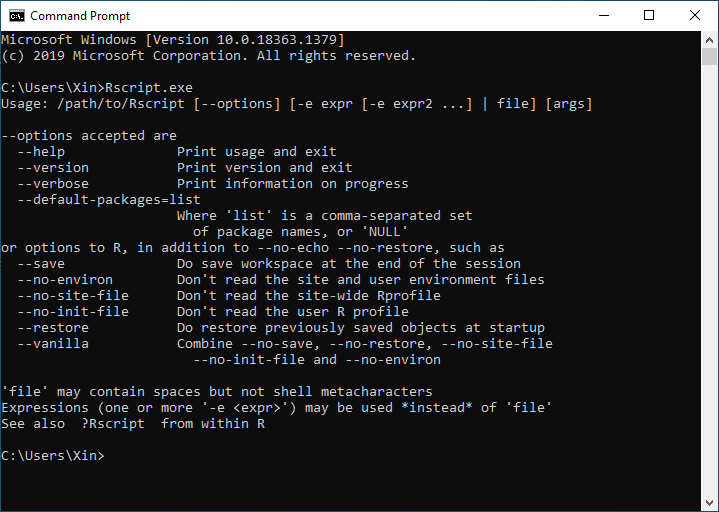

    Prepare a filename.bat file (You may choose the filename as you wish). The content of this .bat file is 'Rscript.exe model_file_name.R' (model_file_name is the filename of the R script). Place this .bat file in the same folder of R script. When MIDA is running, load this .bat file as the model executable. It works the same for models written in Python or MATLAB. 

    Open a terminal, locate to the directory of .bat file, type 'filename.bat' to check the model executable is working correctly. Specially, check whether there are no errors and simulation outputs are newly generated. 

    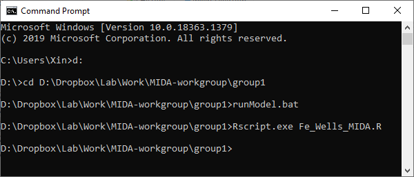

  * Mac and Linux

    Taken R as an example, make sure R is installed. Open a terminal and type 'Rscript'. The output is like the figure below. Otherwise, please reinstall R. 

    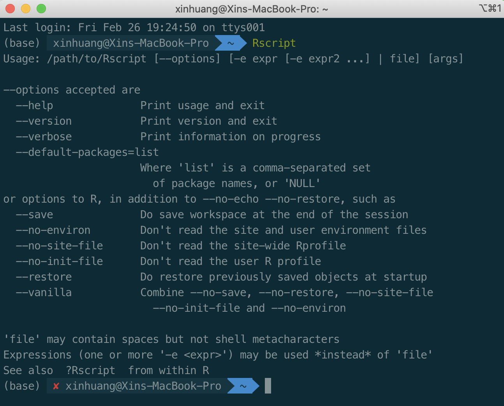

    Modify the R script to add  '\#!/usr/bin/env Rscript' as the first line. 

    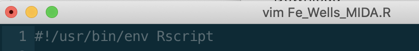

    Open a terminal, locate to the directory of R script, assign executable priority to this file by this command 'chmod 755 model_file_name.R'

    

    Type './Fe_Wells_MIDA.R' to make sure there is no error occurred and the output.txt is newly generated.
    
    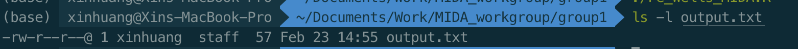
    
    It works the same for models written in Python or MATLAB. 

3. Prepare data files

* GUI version: please prepare param.csv, ParamValue.txt, config.txt, observation text files, observation variance files (optional), parameter variance file (optional), startPoints.csv (optional, if convergence test is required). 

* Command-line version: please prepare param.csv, ParamValue.txt, config.txt, observation text files, printDA.csv, namelist.txt, observation variance files (optional), parameter variance file (optional), startPoints.csv (optional, if convergence test is required). 

  Please refer tutorials in Document/ to get more information about the data files. Moreover, there are samples for the data files under Example/ folder.

4. Select a work path and place MIDA executable (e.g., MIDA.exe in Windows) under this folder

   The work path is where MIDA saves data assimilation results. Notice, model codes usually use relative directory to read file (e.g., ./paramValue.txt is relative directory and D:/work/paramValue.txt is absolute directory). The relative directory is referred to where MIDA.exe is rather than the directory of model executable. Taken ./paramValue.txt as an example, the paramValue.txt needs to be in the same folder as MIDA rather than model executable.

   MIDA executable for both GUI and Command-line versions is under Exe/ folder.

5. Start MIDA

* Windows
  * GUI: Enter the work path, double-click MIDA.exe, two windows generates: one is the main window where user interacts with MIDA; the other is a terminal where information is printed to help users debug. If either windows is closed, MIDA will exit.

    In the main window, first users need to input all necessary information (most are to indicate the directory of data files users prepared) in the upper panel. It is to generate a namelist.txt file in the work path. Users can also prepare the namelist.txt by themselves without MIDA. Second, users need to load the namelist.txt generated and click 'Run Data Assimilation' button in the below panel.

    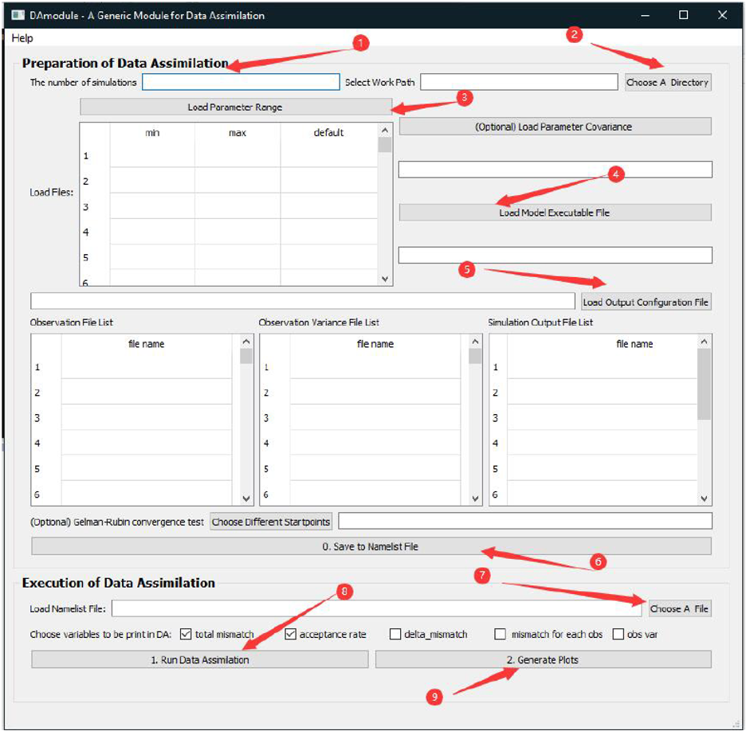

    Once users encounter an error, the detailed information will be printed in the other window (a black terminal) to help users to debug.

    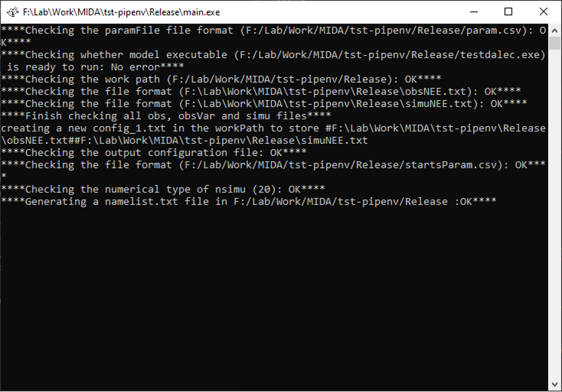

    After DA successfully finished, click 'Generate plots' to visualize parameter posterior distributions and mismatches in the sampling.

  * Command-line: Open a Windows terminal, locate to the work path, type 'MIDA.exe' to trigger the automatic workflow (Data assimilation + Visualization). If any error occurs, there will be information listed in the terminal.

    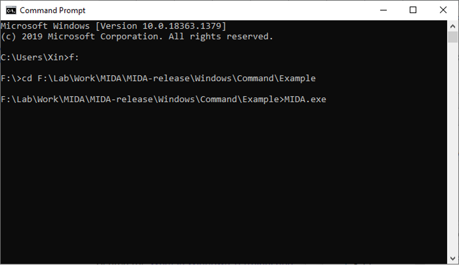
  
* Mac

  No matter GUI or Command-Line version, users need to open a terminal, locate to the work path, type './MIDA' to start the windows for GUI or automatically execute the whole workflow of MIDA.

  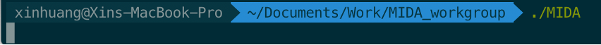

* Linux

  Currently, MIDA only support the Command-line version of MIDA. Its usage is same as that in Mac.

6. Example of DALEC model (DALEC/ under Example/ folder)

* Windows

  * There is already a model executable file (testdalec.exe) generated from model source code (dalec.f90). Please test the model executable (open a Windows terminal, locate to the directory of model executable, type 'testdalec.exe') to make sure model outputs (simuNEE.txt) is correctly generated. If not, please regenerate testdalec.exe with gfortran compiler. 
  * GUI: Change the directories in config.txt, then prepare data and start MIDA as depicted in section 3-5
  * Command-line: Change the directories in both config.txt and namelist.txt, then prepare data and start MIDA as depicted in section 3-5.

* Mac 

  * Make sure the model executable. Open a terminal, type 'chmod 766 dalecModel' to assign executable priority to the model executable (dalecMode for Mac). Then, check the applicability of model executable.

    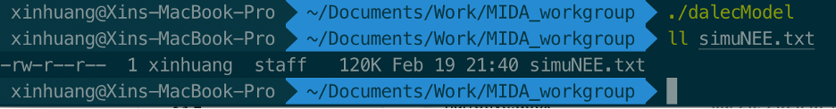

  * Make sure the model executable and MIDA is executable. Users may directly type the commands below in Mac terminal to make model and MIDA are executable

    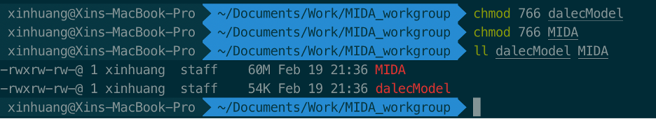

  * Prepare data and start MIDA as depicted in section 3-5. Notice, different from Windows, users with Mac have to type ‘./MIDA’ to start MIDA in the terminal no matter GUI or non-GUI. 

* Linux

  * Similar to Command-line version in Mac.

Please refer to the tutorials in Document/ for more detailed information. If you have more questions, please feel free to contact me (xh59@nau.edu). 
